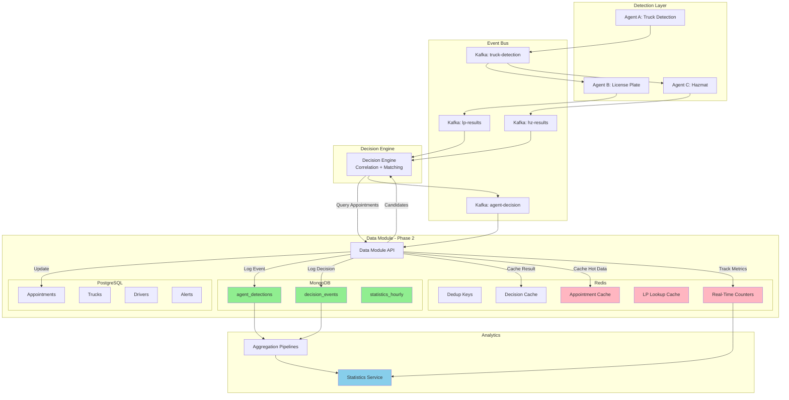

# Phase 2 Event Flow & Data Integration

## Complete Data Flow Architecture



---

## Event Flow Step-by-Step

### 1. Truck Arrives at Gate
```
Agent A detects truck → Kafka truck-detection-{gate_id}
├─ truck_id: TRUCK-12345
├─ timestamp: 2025-02-17T10:30:00Z
├─ confidence: 0.98
└─ crop_url: http://minio:9000/crops/truck_12345.jpg
```

### 2. Agents B & C Process
```
Agent B (license plate) → Kafka lp-results-{gate_id}
├─ truck_id: TRUCK-12345 (correlation)
├─ licensePlate: AA-00-BB
├─ confidence: 0.87
└─ crop_url: http://minio:9000/crops/lp_12345.jpg

Agent C (hazmat) → Kafka hz-results-{gate_id}
├─ truck_id: TRUCK-12345
├─ un: 1203
├─ kemler: 33
├─ confidence: 0.92
└─ crop_url: http://minio:9000/crops/hz_12345.jpg
```

### 3. Decision Engine Correlation
```
Decision Engine consumes LP + HZ results
├─ Buffer by truck_id (correlation)
├─ Query Data Module: GET /decisions/query-appointments
│  └─ Returns candidates from PostgreSQL
├─ Fuzzy match license plate
├─ Apply business rules
└─ Publish decision → Kafka agent-decision-{gate_id}
```

### 4. Data Module Phase 2 Processing

#### A. Agent Detection Logging (MongoDB)
```python
# agent_detections collection
{
  "detection_id": "det_AgentB_1708167000_001",
  "truck_id": "TRUCK-12345",
  "agent_type": "AgentB",
  "gate_id": 1,
  "timestamp": "2025-02-17T10:30:01Z",
  "detection_data": {
    "type": "license_plate_detection",
    "confidence": 0.87,
    "license_plate": "AA-00-BB",
    "crop_url": "http://minio:9000/crops/lp_12345.jpg"
  },
  "processing": {
    "consumed_by_decision_engine": true,
    "processing_latency_ms": 45
  }
}
```

#### B. Decision Event Logging (MongoDB)
```python
# decision_events collection
{
  "decision_id": "dec_gate1_1708167002_042",
  "truck_id": "TRUCK-12345",
  "gate_id": 1,
  "appointment_id": 42,
  
  "agent_detections": {
    "truck_detection": {...},
    "license_plate_detection": {...},
    "hazmat_detection": {...}
  },
  
  "decision_engine": {
    "timestamp": "2025-02-17T10:30:02Z",
    "final_decision": "ACCEPTED",
    "decision_reason": "license_plate_matched",
    "processing_time_ms": 350
  },
  
  "timing": {
    "detection_to_decision_ms": 2000,
    "decision_to_persistence_ms": 150,
    "total_pipeline_ms": 2150
  }
}
```

#### C. PostgreSQL Update (Source of Truth)
```sql
-- Update appointment with normalized fields
UPDATE appointment
SET appointment_status = 'IN_PROCESS'
WHERE appointment_id = 42 AND license_plate = 'AA-00-BB';
-- arrival_id generated via PostgreSQL sequence trigger
```

#### D. Redis Caching & Metrics
```python
# 1. Deduplication (5min TTL)
SET plate:AA-00-BB:gate:1:tb:1708167000 "1" EX 300

# 2. Decision cache (1hr TTL)
SET decision:plate:AA-00-BB:gate:1:tb:1708167000 
    "{...decision_result...}" EX 3600

# 3. Hot appointment cache (30min TTL)
HSET appointment:42:details
  "appointment_id" "42"
  "arrival_id" "12345"
  "license_plate" "AA-00-BB"
  "driver_name" "João Silva"
  "appointment_status" "IN_PROCESS"
EXPIRE appointment:42:details 1800

# 4. License plate lookup
SADD lp_lookup:AA-00-BB:appointments "42"
EXPIRE lp_lookup:AA-00-BB:appointments 600

# 5. Real-time counters (hourly buckets)
INCR counter:gate:1:hour:2025021710:detections
INCR counter:gate:1:hour:2025021710:decisions:accepted
```

---

## Query Patterns

### 1. Real-Time Dashboard (Redis)
```python
# GET /api/v1/statistics/realtime/{gate_id}
# Response time: ~5ms (cache hit)

counters = redis_client.keys(f"counter:gate:{gate_id}:hour:*")
result = {
  "detections": redis_client.get(f"counter:gate:{gate_id}:hour:{hour}:detections"),
  "decisions_accepted": redis_client.get(f"counter:gate:{gate_id}:hour:{hour}:decisions:accepted"),
  "decisions_rejected": redis_client.get(f"counter:gate:{gate_id}:hour:{hour}:decisions:rejected")
}

# Returns:
{
  "detections": {"total": 45, "agent_a": 45, "agent_b": 43, "agent_c": 42},
  "decisions": {"total": 42, "accepted": 35, "rejected": 2, "manual_review": 5},
  "timestamp": "2025-02-17T10:45:00Z"
}
```

### 2. Pipeline Performance (MongoDB Aggregation)
```python
# GET /api/v1/statistics/pipeline/performance?gate_id=1&hours=24
# Response time: ~150ms (aggregation)

pipeline = [
  {"$match": {"gate_id": gate_id, "created_at": {"$gte": cutoff}}},
  {"$group": {
    "_id": "$gate_id",
    "total_decisions": {"$sum": 1},
    "accepted": {"$sum": {"$cond": [{"$eq": ["$decision_engine.final_decision", "ACCEPTED"]}, 1, 0]}},
    "avg_pipeline_time": {"$avg": "$timing.total_pipeline_ms"},
    "p95_pipeline_time": {"$percentile": {"input": "$timing.total_pipeline_ms", "p": [0.95], "method": "approximate"}}
  }}
]

# Returns:
{
  "total_decisions": 842,
  "acceptance_rate": 0.83,
  "manual_review_rate": 0.12,
  "performance": {
    "avg_pipeline_ms": 320,
    "p95_pipeline_ms": 550,
    "p99_pipeline_ms": 890
  }
}
```

### 3. Truck Journey (MongoDB Query)
```python
# GET /api/v1/statistics/truck/{truck_id}/journey
# Response time: ~80ms (indexed lookup)

detections = db.agent_detections.find(
  {"truck_id": truck_id}
).sort("timestamp", 1)

decision = db.decision_events.find_one({"truck_id": truck_id})

# Returns:
{
  "truck_id": "TRUCK-12345",
  "detections": [
    {"agent": "AgentA", "timestamp": "10:30:00", "confidence": 0.98},
    {"agent": "AgentB", "timestamp": "10:30:01", "confidence": 0.87, "license_plate": "AA-00-BB"},
    {"agent": "AgentC", "timestamp": "10:30:01", "confidence": 0.92, "un": "1203", "kemler": "33"}
  ],
  "decision": {
    "final_decision": "ACCEPTED",
    "decision_reason": "license_plate_matched",
    "appointment_id": 42,
    "timing": {"total_pipeline_ms": 2150}
  },
  "timeline": {
    "first_detection": "2025-02-17T10:30:00Z",
    "decision_made": "2025-02-17T10:30:02Z",
    "postgres_updated": "2025-02-17T10:30:03Z"
  }
}
```

### 4. Appointment Lookup (Redis → PostgreSQL)
```python
# GET /api/v1/appointments/{appointment_id}
# Response time: ~10ms (cache hit) or ~120ms (cache miss)

# Try Redis cache first
cached = redis_client.hgetall(f"appointment:{appointment_id}:details")
if cached:
    return cached  # Fast path: 10ms

# Cache miss → Query PostgreSQL
appointment = db.query(Appointment).filter(Appointment.appointment_id == appointment_id).first()
# PostgreSQL trigger guarantees arrival_id via sequence

# Populate cache for next request
redis_client.hset(f"appointment:{appointment_id}:details", mapping=appointment.dict())
redis_client.expire(f"appointment:{appointment_id}:details", 1800)

return appointment
```
---

## Phase 2 Benefits

| Capability | Description | Impact |
|-----------|-------------|--------|
| **Complete Audit Trail** | Every detection and decision logged in MongoDB with timing | Full debugging & replay |
| **High Performance** | Redis caching: <10ms queries, 75-85% cache hit rate | 10-16× faster queries |
| **Real-Time Insights** | Live counters in Redis with hourly buckets | Sub-second dashboard updates |
| **Scalability** | MongoDB sharding, Redis cluster, event sourcing | Horizontal scaling ready |
| **Data Integrity** | PostgreSQL source of truth, MongoDB immutable log, Redis transient cache | Zero data loss |

---

## Integration Points

### Decision Service Implementation
```python
# DecisionIncomingRequest (Pydantic model with backward compatibility)
@model_validator(mode='after')
def normalize_fields(self):
    # Accept both new (appointment_status/delivery_state) and legacy (status/state) fields
    if hasattr(self, 'status') and self.status:
        self.appointment_status = self.appointment_status or self.status
    if hasattr(self, 'state') and self.state:
        self.delivery_state = self.delivery_state or self.state
    return self

# Process decision with enhanced logging
await process_incoming_decision(
    appointment_status=request.appointment_status,  # Normalized field
    delivery_state=request.delivery_state,          # Optional field
    ...
)
```

### Statistics Service Aggregation
```python
# Real-time metrics from Redis
metrics = get_all_active_counters(gate_id)
trend = get_counter_range(gate_id, metric, hours)

# Historical analytics from MongoDB
stats = agent_detections_collection.aggregate(pipeline)
performance = decision_events_collection.aggregate(pipeline)
```

### Shift Type Parsing (New Utility)
```python
# utils/shift_utils.py
def parse_shift_type(shift_input: str) -> ShiftType:
    """Parse shift aliases (MORNING, AFTERNOON, NIGHT) and time ranges."""
    alias_map = {
        "MORNING": ShiftType.SHIFT_07_15,
        "AFTERNOON": ShiftType.SHIFT_15_23,
        "NIGHT": ShiftType.SHIFT_23_07
    }
    return alias_map.get(shift_input.upper()) or ShiftType(shift_input)
```

---

## MongoDB Indexes (Required)

```javascript
// agent_detections collection
db.agent_detections.createIndex({"truck_id": 1, "timestamp": 1});
db.agent_detections.createIndex({"gate_id": 1, "created_at": -1});
db.agent_detections.createIndex({"agent_type": 1, "created_at": -1});

// decision_events collection
db.decision_events.createIndex({"truck_id": 1}, {unique: true});
db.decision_events.createIndex({"gate_id": 1, "created_at": -1});
db.decision_events.createIndex({"appointment_id": 1});
db.decision_events.createIndex({"decision_engine.final_decision": 1, "created_at": -1});
```

---

## Redis Key Patterns (Reference)

| Pattern | TTL | Purpose |
|---------|-----|---------|
| `plate:{lp}:gate:{id}:tb:{ts}` | 300s | Deduplication |
| `decision:plate:{lp}:gate:{id}:tb:{ts}` | 3600s | Decision cache |
| `appointment:{id}:details` | 1800s | Hot appointment data |
| `lp_lookup:{lp}:appointments` | 600s | License plate → appointment_id |
| `counter:gate:{id}:hour:{hour}:{metric}` | 7200s | Real-time counters |

---

## API Endpoints

| Endpoint | Method | Response Time | Data Source |
|----------|--------|---------------|-------------|
| `/api/v1/statistics/realtime/{gate_id}` | GET | ~10ms | Redis counters |
| `/api/v1/statistics/pipeline/performance` | GET | ~150ms | MongoDB aggregation |
| `/api/v1/statistics/truck/{truck_id}/journey` | GET | ~80ms | MongoDB query |
| `/api/v1/appointments/{id}` | GET | ~15ms (cached) | Redis → PostgreSQL |
| `/decisions/query-appointments` | GET | ~120ms | PostgreSQL |
| `/decisions/incoming` | POST | ~200ms | PostgreSQL + MongoDB + Redis |
