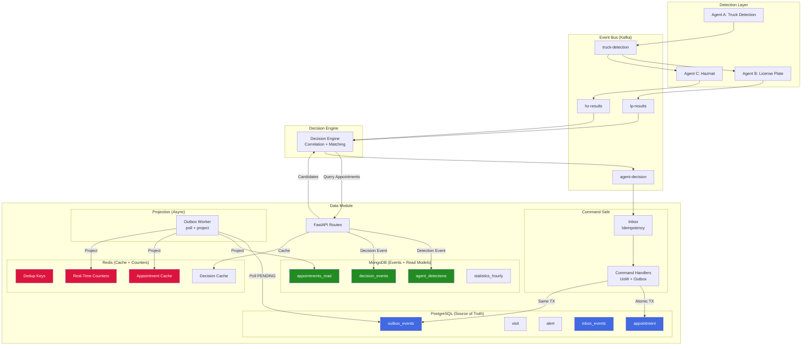

# Event Flow & Data Integration

**Last updated:** 2026-03-20

## Complete Data Flow Architecture



---

## Event Flow Step-by-Step

### 1. Truck Arrives at Gate

```
Agent A detects truck → Kafka truck-detection-{gate_id}
├─ truck_id: TRUCK-12345
├─ timestamp: 2025-02-17T10:30:00Z
├─ confidence: 0.98
└─ crop_url: http://minio:9000/crops/truck_12345.jpg
```

### 2. Agents B & C Process

```
Agent B (license plate) → Kafka lp-results-{gate_id}
├─ truck_id: TRUCK-12345 (correlation key)
├─ licensePlate: AA-00-BB
├─ confidence: 0.87
└─ crop_url: http://minio:9000/crops/lp_12345.jpg

Agent C (hazmat) → Kafka hz-results-{gate_id}
├─ truck_id: TRUCK-12345
├─ un: 1203, kemler: 33
├─ confidence: 0.92
└─ crop_url: http://minio:9000/crops/hz_12345.jpg
```

### 3. Decision Engine Correlation

```
Decision Engine consumes LP + HZ results
├─ Buffer by truck_id (correlation)
├─ Query Data Module: POST /decisions/query-appointments
│  └─ Returns candidates from PostgreSQL (via Redis cache)
├─ Fuzzy match license plate against candidates
├─ Apply business rules (hazmat validation, booking check)
└─ Publish decision → Kafka agent-decision-{gate_id}
```

### 4. Data Module Processing (Event-Driven Path)

```
KafkaDecisionConsumer receives agent-decision
├─ Build EventEnvelope (UUIDv7 event_id, 11 fields)
├─ Route to ContainerMovedHandler
│
ContainerMovedHandler.handle(envelope, context)
├─ A. Inbox INSERT — idempotency gate (UNIQUE event_id)
│     └─ Duplicate? → ACK + NOOP (no side effects)
├─ B. Inbox mark PROCESSING
├─ C. SELECT appointment FOR UPDATE (aggregate lock)
├─ D. Execute state transition (status → IN_PROCESS)
├─ E. Outbox APPEND (AppointmentStateChanged event, same TX)
├─ F. Inbox mark PROCESSED
├─ G. UoW COMMIT (single atomic PG transaction)
└─ H. Kafka consumer.commit() (only after PG success)
```

### 5. Async Projection (Outbox Worker)

```
Outbox Worker (polls every 2 seconds)
├─ Fetch PENDING + retryable FAILED rows (batch of 50)
├─ For each row:
│   ├─ project_to_mongo()
│   │   └─ Upsert to appointments_read (by appointment_id)
│   ├─ project_to_redis()
│   │   ├─ Invalidate stale cache
│   │   ├─ Write full appointment snapshot
│   │   └─ Increment gate counter
│   └─ Mark PUBLISHED (set published_at timestamp)
├─ On transient error:
│   ├─ Increment retry_count
│   ├─ Compute next_retry_at (2^n sec, max 60s, +jitter)
│   └─ Mark FAILED
├─ On permanent error (KeyError, ValueError, TypeError):
│   └─ Mark DEAD_LETTER immediately
└─ After MAX_RETRIES (5):
    └─ Mark DEAD_LETTER
```

### 6. Frontend Reads (CQRS)

```
Operator Dashboard → GET /arrivals/next/{gate_id}
├─ Redis cache hit? → return (< 10ms)
├─ MongoDB appointments_read? → return + cache (< 50ms)
└─ PostgreSQL fallback → return + cache (< 120ms)

Real-time updates arrive via:
├─ WebSocket (API Gateway consumes Kafka → broadcasts to gate channel)
└─ Polling with Redis counters (dashboard summary)
```

---

## Decision Scenarios

| Scenario | Agent Decision | Operator | Final | PG Updated |
|----------|---------------|----------|-------|------------|
| Auto Accepted | ACCEPTED | — | ACCEPTED | appointment → IN_PROCESS |
| Manual → Accepted | MANUAL_REVIEW | ACCEPTED | ACCEPTED | appointment → IN_PROCESS |
| Manual → Rejected | MANUAL_REVIEW | REJECTED | REJECTED | No update, alert created |
| Highway Infraction | — | — | FLAGGED | appointment.highway_infraction = true |

See `Decision_Flow_Examples.md` for full MongoDB document examples of each scenario.

---

## Query Patterns by Data Source

### Redis (< 10ms) — Real-time

```python
# Dashboard counters
counters = get_all_active_counters(gate_id)
# Single appointment
cached = redis_client.hgetall(f"appointment:{id}:details")
```

### MongoDB (< 150ms) — Analytics

```python
# Pipeline performance
db.decision_events.aggregate([
  {"$match": {"gate_id": gate_id, "created_at": {"$gte": cutoff}}},
  {"$group": {"_id": "$gate_id", "avg_ms": {"$avg": "$timing.total_pipeline_ms"}}}
])

# Truck journey timeline
db.agent_detections.find({"truck_id": truck_id}).sort("timestamp", 1)
```

### PostgreSQL (< 120ms) — Authoritative Fallback

```python
# Only when Redis + Mongo miss
appointment = session.query(Appointment).filter(Appointment.id == id).first()
```

---

## Redis Key Reference

| Pattern | TTL | Purpose |
|---------|-----|---------|
| `dedup:event:{event_id}` | 300s | Event idempotency |
| `dedup:plate:{lp}:gate:{id}:tb:{ts}` | 300s | Detection dedup |
| `decision:plate:{lp}:gate:{id}:tb:{ts}` | 3600s | Decision cache |
| `appointment:{id}:details` | 1800s | Hot appointment data |
| `lp_lookup:{lp}:appointments` | 600s | Plate → appointment lookup |
| `counter:gate:{id}:hour:{YYYYMMDDHH}:{metric}` | 7200s | Real-time counters |
| `pending_review:{truck_id}` | 1800s | Operator correlation |

---

## MongoDB Index Reference

```javascript
// agent_detections
db.agent_detections.createIndex({"truck_id": 1, "timestamp": 1});
db.agent_detections.createIndex({"gate_id": 1, "created_at": -1});
db.agent_detections.createIndex({"agent_type": 1, "created_at": -1});

// decision_events
db.decision_events.createIndex({"truck_id": 1}, {unique: true});
db.decision_events.createIndex({"gate_id": 1, "created_at": -1});
db.decision_events.createIndex({"appointment_id": 1});

// appointments_read
db.appointments_read.createIndex({"appointment_id": 1}, {unique: true});
db.appointments_read.createIndex({"status": 1, "scheduled_start_time": -1});
```
