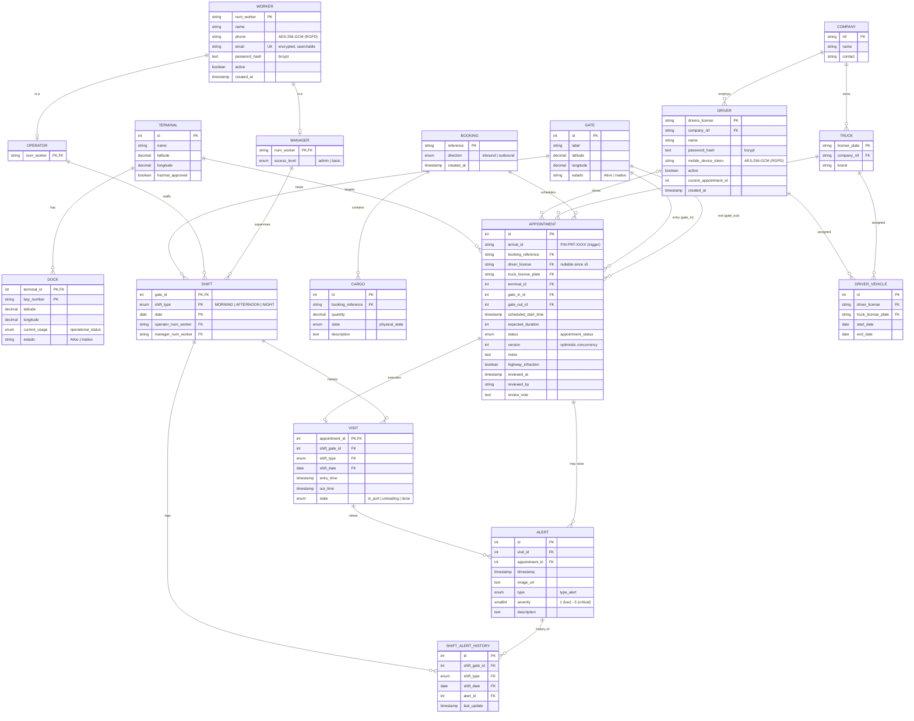

# Domain Model — Data Module (PostgreSQL)

> Modelo de domínio da base de dados relacional (fonte de verdade ACID).
> **Fonte:** `src/V_APP/Data_Module/infrastructure/persistence/sql_models.py` (+ `inbox_outbox_models.py`).
> Detalhe coluna-a-coluna: [`Relacional/Base_Dados_relacional.md`](Relacional/Base_Dados_relacional.md)
> e `code_documentation/V_APP/Data_Module/SCHEMA_REFERENCE.md`.
>
> Diagrama em **Mermaid `erDiagram`** — renderiza diretamente no GitHub/GitLab/VS Code.
> Para exportar imagem (ex.: relatório LaTeX): colar em <https://mermaid.live> ou `mmdc -i domain_model.md -o domain_model.png`.

## Notas
- **Sub-estados computados** (nunca armazenados): `delayed`, `unloading`, `in_port`, `leaving_port`
  derivam de `appointment.status` + `visit.state` + tempo (`computed_status` no ORM).
- **DRIVER_VEHICLE** materializa a relação M:N Condutor↔Camião com histórico temporal (BR-52).
- Tabelas de infraestrutura de eventos (`inbox_events`, `outbox_events`, `pending_reviews`,
  `schema_migrations`) não fazem parte do modelo de domínio — ver `SCHEMA_REFERENCE.md`.
