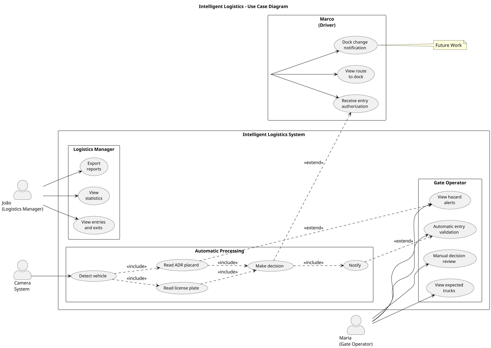

# Use Case Diagram - Intelligent Logistics

```plantuml
@startuml
scale 1.5
left to right direction
skinparam packageStyle rectangle
skinparam actorStyle awesome
skinparam shadowing false
skinparam defaultFontName Arial
skinparam defaultFontSize 14
skinparam usecaseFontSize 13
skinparam actorFontSize 14
skinparam packageFontSize 15

title Intelligent Logistics - Use Case Diagram

' === ACTORS ===
actor "Marco\n(Driver)" as Driver
actor "João\n(Logistics Manager)" as Manager  
actor "Maria\n(Gate Operator)" as Operator
actor "Camera\nSystem" as Camera

rectangle "Intelligent Logistics System" {
    
    package "Driver" {
        usecase "Receive entry\nauthorization" as UC_D1
        usecase "View route\nto dock" as UC_D2
        usecase "Dock change\nnotification" as UC_D3
    }
    
    package "Logistics Manager" {
        usecase "View\nstatistics" as UC_M1
        usecase "View entries\nand exits" as UC_M2
        usecase "Export\nreports" as UC_M3
    }
    
    package "Gate Operator" {
        usecase "View expected\ntrucks" as UC_O1
        usecase "Automatic entry\nvalidation" as UC_O2
        usecase "Manual decision\nreview" as UC_O3
        usecase "View hazard\nalerts" as UC_O4
    }
    
    package "Automatic Processing" {
        usecase "Detect vehicle" as UC_S1
        usecase "Read license plate" as UC_S2
        usecase "Read ADR placard" as UC_S3
        usecase "Make decision" as UC_S4
        usecase "Notify" as UC_S5
    }
}

' === ACTOR CONNECTIONS ===
Driver --> UC_D1
Driver --> UC_D2
Driver --> UC_D3

Manager --> UC_M1
Manager --> UC_M2
Manager --> UC_M3

Operator --> UC_O1
Operator --> UC_O2
Operator --> UC_O3
Operator --> UC_O4

Camera --> UC_S1

' === SYSTEM FLOW ===
UC_S1 ..> UC_S2 : <<include>>
UC_S1 ..> UC_S3 : <<include>>
UC_S2 ..> UC_S4 : <<include>>
UC_S3 ..> UC_S4 : <<include>>
UC_S4 ..> UC_S5 : <<include>>

' === CROSS-ACTOR RELATIONSHIPS ===
UC_S4 ..> UC_D1 : <<extend>>
UC_S5 ..> UC_O2 : <<extend>>
UC_S3 ..> UC_O4 : <<extend>>

note right of UC_D3
  Future Work
end note

@enduml
```
