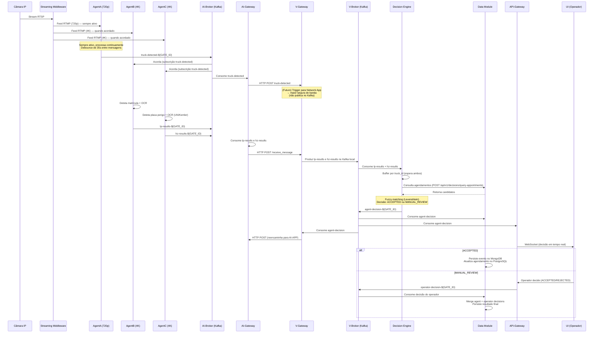

# Arquitetura do Sistema — Intelligent Logistics

> Referência visual: [arch.png](./arch.png)

---

## Infraestrutura — VMs e Componentes

O projeto está distribuído por **5 Virtual Machines**, cada uma com uma responsabilidade distinta:

| VM | IP | Função |
|----|-----|--------|
| **AI-APP** | `10.255.32.110` | Agentes de deteção IA (YOLO) + Broker Kafka |
| **V-APP** | `10.255.32.70` | Lógica de decisão, Data Module, API Gateway |
| **UI** | `10.255.32.108` | Interface web (React) |
| **Streaming Middleware** | `10.255.32.56` | Ingestão e redistribuição de streams de vídeo |
| **DevOps** | `10.255.32.132` | Observabilidade (Grafana, Loki, Prometheus, Jenkins) |

---

## 1. Streaming Middleware

Corre uma infraestrutura baseada em **NGINX RTMP** que:

- **Ingere** feeds RTSP a partir da(s) câmara(s) IP.
- **Converte** para **RTMP** (baixa latência, usado pelos agentes) e **HLS** (usado pelo frontend com um pequeno delay).
- Disponibiliza duas qualidades: **720p (LOW)** para o AgentA e **4K (HIGH)** para o AgentB/AgentC.

📖 Documentação detalhada: [streaming_middleware/README.md](../../src/streaming_middleware/README.md)

---

## 2. AI-APP — Agentes de Deteção

Estrutura composta por **3 agentes**, um **broker Kafka** e um **AI-Gateway**.

### AgentA — Deteção de Camiões

- Corre um modelo **YOLO** para detetar camiões no feed de vídeo (stream 720p/LOW).
- Está **sempre ativo** (24/7), processando frames continuamente.
- Quando deteta um camião, publica no broker no tópico `truck-detected-${GATE_ID}`.
- Usa um mecanismo de **throttling (debounce)** de 35 segundos entre mensagens.
- Também guarda crops das deteções no **MinIO** (bucket `agenta-${GATE_ID}`).

### AgentB — Deteção e Leitura de Matrículas

- Subscreve-se ao tópico `truck-detected-${GATE_ID}` para ser ativado.
- Usa um modelo **YOLO** para detetar a matrícula do camião no stream 4K/HIGH.
- Inclui um **PlateClassifier** para filtrar placas de perigo (rejeita-as, estas são para o AgentC).
- Faz **OCR (PaddleOCR)** para ler o conteúdo da matrícula com algoritmo de consenso.
- Guarda os crops das matrículas no **MinIO** (bucket `agentb-${GATE_ID}`).
- Publica os resultados no tópico `lp-results-${GATE_ID}`.

### AgentC — Deteção de Placas de Perigo

- Subscreve-se ao tópico `truck-detected-${GATE_ID}` para ser ativado.
- Usa um modelo **YOLO treinado pela equipa**, com imagens de diferentes datasets e labels feitos manualmente.
- Faz **OCR (PaddleOCR)** para extrair códigos **UN** e **Kemler** (formato esperado: `"KEMLER UN"`, ex: `"33 1203"`).
- Guarda os crops das placas no **MinIO** (bucket `agentc-${GATE_ID}`).
- Publica os resultados no tópico `hz-results-${GATE_ID}`.

### AI-Gateway

- **Consome** os tópicos `truck-detected-${GATE_ID}`, `lp-results-${GATE_ID}` e `hz-results-${GATE_ID}` do Kafka local (AI-APP).
- **Reencaminha** essas mensagens via HTTP POST para o **V-Gateway** (`http://10.255.32.70:8003/receive_message`).
- **Recebe** mensagens do V-Gateway (via HTTP POST em `/receive_message`) e produz no tópico local `agent-decision-${GATE_ID}`.
- Funciona de forma **bidirecional** (baseado no `BaseGateway`).

> ⚠️ **Nota:** Atualmente o AI-Gateway apenas consome `lp-results` e `hz-results`. O consumo de `truck-detected` precisa de ser implementado (ver [TODO](#todo)).

### AI-Broker (Kafka)

- Gere todo o fluxo de mensagens entre os componentes da AI-APP.
- Implementado com **Apache Kafka** (modo KRaft, sem Zookeeper).
- **Tópicos geridos:**

| Tópico | Descrição |
|--------|-----------|
| `truck-detected-${GATE_ID}` | Camião detetado pelo AgentA |
| `lp-results-${GATE_ID}` | Resultado da leitura de matrícula (AgentB) |
| `hz-results-${GATE_ID}` | Resultado da deteção de placa de perigo (AgentC) |
| `operator-decision-${GATE_ID}` | Decisão do operador (vinda do V-Gateway) |
| `agent-decision-${GATE_ID}` | Decisão do Decision Engine (vinda do V-Gateway) |

📖 Documentação dos componentes:
- [AgentA](../../src/AI_APP/agentA/README.md)
- [AgentB](../../src/AI_APP/agentB/README.md)
- [AgentC](../../src/AI_APP/agentC/README.md)
- [AI-Gateway](../../src/AI_APP/gateway/README.md)
- [AI-Broker](../../src/AI_APP/broker/README.md)

---

## 3. V-APP — Lógica de Negócio e Decisão

Contém **5 componentes** principais:

### V-Gateway

- **Recebe** mensagens do AI-Gateway (via HTTP POST em `/receive_message`) e produz nos tópicos locais `lp-results-${GATE_ID}` e `hz-results-${GATE_ID}` no Kafka da V-APP.
- Ao receber `truck-detected` do AI-Gateway, **não o publica no Kafka** — utiliza-o diretamente para enviar o trigger à Network App.
- **Consome** o tópico `agent-decision-${GATE_ID}` do V-Broker e reencaminha via HTTP POST para o AI-Gateway (`http://10.255.32.110:8003/receive_message`).
- Funciona de forma **bidirecional** (baseado no `BaseGateway`).
- **Futuro:** Ao receber `truck-detected`, irá enviar um trigger para a **Network App** (desenvolvida por um colaborador (Tiago Barros 🐐) para o Porto de Aveiro), que ajustará a largura de banda da rede conforme a necessidade:
  - Menor largura de banda → apenas deteção de camiões.
  - Maior largura de banda → deteção + leitura de matrículas e placas de perigo.

> ⚠️ **Nota:** Atualmente o V-Gateway só produz `lp-results` e `hz-results`. O handling de `truck-detected` e o trigger para a Network App precisam de ser implementados (ver [TODO](#todo)).

### Decision Engine

- Consome os tópicos `lp-results-${GATE_ID}` e `hz-results-${GATE_ID}` do V-Broker.
- Faz buffer dos resultados por `truck_id` e, quando tem ambos (matrícula + placa de perigo), inicia o processo de decisão.
- Consulta o **Data Module** via API REST (`POST /api/v1/decisions/query-appointments`) para obter agendamentos candidatos.
- Utiliza **Levenshtein distance** (via `PlateMatcher`) para matching fuzzy de matrículas (tolerância a erros de OCR, threshold configurável via `MAX_LEVENSHTEIN_DISTANCE`, default: 2).
- Publica a decisão no tópico **`agent-decision-${GATE_ID}`**.
- **Decisões possíveis** (enum `DecisionStatus`):

| Decisão | Causa (`decision_reason`) |
|---------|---------------------------|
| `ACCEPTED` | `license_plate_matched` — matrícula corresponde a um agendamento |
| `MANUAL_REVIEW` | `license_plate_not_detected` — matrícula não detetada (N/A) |
| `MANUAL_REVIEW` | `api_unavailable` — Data Module indisponível |
| `MANUAL_REVIEW` | `empty_db_appointments` — nenhum agendamento encontrado |
| `MANUAL_REVIEW` | `license_plate_not_found` — matrícula não corresponde a nenhum agendamento |

📖 Documentação: [Decision Engine README](../../src/V_APP/decision_engine/README.md)

### Data Module

- Gere a **base de dados do porto**, implementada com:
  - **PostgreSQL** — dados relacionais e estruturados (agendamentos, veículos, etc.)
  - **MongoDB** — eventos de decisão e logs
  - **Redis** — cache e dados temporários
  - **MinIO** — object storage para crops de imagens dos agentes
- Consome os tópicos **`agent-decision-${GATE_ID}`** e **`operator-decision-${GATE_ID}`** via `KafkaDecisionConsumer`:
  - Se `ACCEPTED` → persiste o evento no MongoDB e atualiza o agendamento no PostgreSQL.
  - Se `MANUAL_REVIEW` → aguarda no `DecisionCorrelator` até receber a decisão do operador em `operator-decision-${GATE_ID}`. A decisão final do operador sobrepõe-se à do agente.
- Expõe uma API REST consumida pelo Decision Engine para consultar agendamentos.

### V-Broker (Kafka)

- Broker de mensagens interno da V-APP (Apache Kafka, modo KRaft).
- Replica os mesmos tópicos da AI-APP mais o `decision-results` (legado, não usado no código atual).
- **Tópicos efetivamente usados:**

| Tópico | Produtores | Consumidores |
|--------|-----------|--------------|
| `lp-results-${GATE_ID}` | V-Gateway | Decision Engine |
| `hz-results-${GATE_ID}` | V-Gateway | Decision Engine |
| `agent-decision-${GATE_ID}` | Decision Engine | V-Gateway, API-Gateway, Data Module |
| `operator-decision-${GATE_ID}` | API-Gateway | Data Module |

### API-Gateway

- Faz a ponte entre a V-APP e o exterior (nomeadamente a **UI**).
- Consome o tópico **`agent-decision-${GATE_ID}`** e envia decisões para a UI via **WebSockets** em tempo real (através do `WebSocketManager`).
- Quando o operador toma uma decisão manual na UI, o API-Gateway publica no tópico **`operator-decision-${GATE_ID}`**.
- Serve como proxy REST para o **Data Module** (routers: arrivals, manual_review, alerts, drivers, stream, workers).
- Implementa **CORS**, **Prometheus metrics**, **OpenTelemetry tracing**.

---

## 4. UI — Interface Web

- Repositório separado: [IntelligentLogistics_APP](https://github.com/PEI-HAZARDS/IntelligentLogistics_APP)
- Desenvolvida em **React** com 3 perspetivas:
  1. **Operador de Cancela** — monitoriza chegadas ao porto, feed da câmara em tempo real e informações de deteções em tempo real.
  2. **Motorista** — *(sem impacto significativo para a demonstração de 25/03/2026)*.
  3. **Gestor Logístico** — *(sem impacto significativo para a demonstração de 25/03/2026)*.

---

## 5. DevOps — Observabilidade e CI/CD

Infraestrutura de monitorização e deployment:

- **Grafana + Loki** — dashboards e sistema de logs centralizado.
- **Prometheus + Node Exporter** — métricas de sistema de cada VM.
- **Tempo** — tracing distribuído (OpenTelemetry).
- **Alertmanager** — alertas automáticos.
- **Jenkins** — pipeline de CI/CD para deployment automático.
- **Promtail** — coletor de logs de containers Docker (presente em cada VM).

---

## Fluxo Completo do Sistema

### Descrição Passo-a-Passo

1. **Chegada do camião** — Uma câmara IP capta o vídeo da entrada do porto. O Streaming Middleware ingere este feed RTSP e converte-o em RTMP (para agentes) e HLS (para o frontend).

2. **Deteção do camião (AgentA)** — O AgentA, sempre ativo, processa o feed em 720p e deteta a presença de um camião. Publica uma mensagem no tópico `truck-detected-${GATE_ID}` (neste momento, `GATE_ID = 1`, pois só existe uma câmara). Existe um debounce de 35 segundos entre mensagens para evitar duplicados.

3. **Ativação dos agentes B e C** — Ambos os agentes, subscritos ao tópico `truck-detected`, "acordam" e começam a processar o stream 4K:
   - **AgentB** deteta a matrícula com YOLO, filtra placas de perigo com o `PlateClassifier`, e lê o texto com PaddleOCR.
   - **AgentC** deteta a placa de perigo com YOLO e extrai os códigos UN e Kemler com PaddleOCR.
   - Ambos guardam os crops no **MinIO** nos buckets respetivos.

   > **Nota:** Atualmente, os agentes começam a processar imediatamente após o trigger, independentemente da largura de banda já estar otimizada, para não terem de esperar por uma confirmação. Podem perder os primeiros frames. Este comportamento poderá mudar no futuro.

4. **Publicação e propagação de resultados** — O AgentB publica em `lp-results-${GATE_ID}` e o AgentC em `hz-results-${GATE_ID}`. O **AI-Gateway** consome estes tópicos e reencaminha via HTTP POST para o **V-Gateway**, que os pubica no Kafka local da V-APP.

5. **Decisão (Decision Engine)** — O Decision Engine consome ambos os tópicos, faz buffer por `truck_id` até ter ambos os resultados, consulta o Data Module para agendamentos candidatos e aplica matching fuzzy com Levenshtein distance. Publica a decisão em **`agent-decision-${GATE_ID}`** — sendo `ACCEPTED` (matrícula corresponde) ou `MANUAL_REVIEW` (vários cenários: matrícula não detetada, API indisponível, sem agendamentos, ou matrícula não encontrada).

6. **Distribuição da decisão** — O tópico `agent-decision-${GATE_ID}` é consumido por:
   - **Data Module** — persiste o evento.
   - **API-Gateway** — envia para a UI via WebSocket.
   - **V-Gateway** — reencaminha para o AI-Gateway (que produz no Kafka da AI-APP).

7. **Persistência (Data Module)** — Se `ACCEPTED`, o Data Module persiste o evento no MongoDB e atualiza o status do agendamento no PostgreSQL. Se `MANUAL_REVIEW`, o `DecisionCorrelator` fica em espera até receber a decisão do operador.

8. **Decisão manual (se necessário)** — O operador de cancela visualiza a informação na UI (feed da câmara, dados das deteções) e toma uma decisão final (`ACCEPTED` ou `REJECTED`). A UI envia esta decisão para o API-Gateway, que publica em `operator-decision-${GATE_ID}`. O Data Module consome esta mensagem, faz merge com a decisão do agente (a decisão do operador sobrepõe-se), e persiste o resultado final.

---

## TODO

- [ ] **AI-Gateway: consumir `truck-detected-${GATE_ID}`** — Adicionar `truck-detected-${GATE_ID}` à lista de tópicos consumidos no `ai_gateway.py` (`get_topics_consume()`) para que o V-Gateway receba a notificação de camião detetado.

- [ ] **V-Gateway: trigger para a Network App** — Implementar lógica no `process_message()` do V-Gateway para que, ao receber uma mensagem `truck-detected`, envie um trigger HTTP para a Network App ativar maior largura de banda na rede do porto.

- [ ] **Documentação para AI-Broker/AI-Gateway/API-Gateway/V-Gateway**
