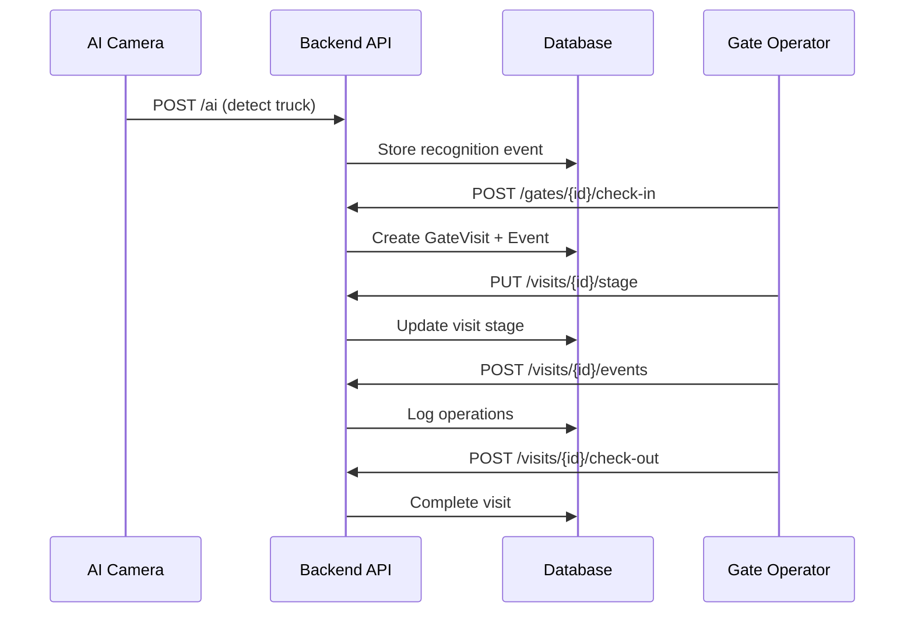

# Truck Visit Flow - API Integration Guide

This document describes the complete flow of a truck visit from gate arrival to exit, including all API calls required to track the visit lifecycle.

## Flow Overview



---

## Phase 1: Pre-Arrival (Appointment)

Before arriving, the hauler creates an appointment for the truck.

### 1.1 Create Appointment
```http
POST /api/v1/appointments
Authorization: Bearer {token}
Content-Type: application/json

{
  "booking_id": 1,
  "hauler_id": 1,
  "truck_id": 1,
  "driver_id": 1,
  "scheduled_start_time": "2024-12-11T10:00:00Z",
  "scheduled_end_time": "2024-12-11T11:00:00Z"
}
```

**Response:** `201 Created`
```json
{
  "appointment_id": 1,
  "appointment_status": "CREATED",
  ...
}
```

### 1.2 Confirm Appointment
```http
POST /api/v1/appointments/{appointment_id}/confirm
Authorization: Bearer {token}
```

**Response:** `200 OK` - Status changes to `CONFIRMED`

---

## Phase 2: Gate Arrival

When the truck arrives at the gate, the AI camera detects it.

### 2.1 AI Recognition Event
```http
POST /api/v1/ai/events
Authorization: Bearer {token}
Content-Type: application/json

{
  "gate_id": 1,
  "object_class": "TRUCK",
  "detected_text": "PT-12-AB",
  "confidence_score": 0.95,
  "bounding_box_json": {"x": 100, "y": 200, "width": 300, "height": 100},
  "image_storage_path": "/images/2024/12/11/gate1_001.jpg",
  "processing_duration_ms": 45
}
```

**Response:** `201 Created`
```json
{
  "recognition_id": 1,
  "requires_review": false,
  ...
}
```

> **Note:** If `confidence_score < 0.85`, an AI correction is auto-created for operator review.

### 2.2 Gate Check-In
```http
POST /api/v1/gates/{gate_id}/check-in
Authorization: Bearer {token}
Content-Type: application/json

{
  "truck_id": 1,
  "driver_id": 1,
  "appointment_id": 1
}
```

**What happens:**
1. Validates gate status (must be `OPEN`)
2. Creates `GateVisit` record with stage `AT_GATE`
3. Creates `VisitEventLog` entry (type: `GATE_CHECK_IN`)
4. Links to appointment if provided

**Response:** `201 Created`
```json
{
  "visit_id": 1,
  "visit_stage": "AT_GATE",
  "gate_in_time": "2024-12-11T10:05:00Z",
  ...
}
```

---

## Phase 3: In-Transit Operations

### 3.1 Route Truck to Yard
```http
PUT /api/v1/visits/{visit_id}/stage
Authorization: Bearer {token}
Content-Type: application/json

{
  "visit_stage": "ROUTED",
  "target_zone_id": 2
}
```

**Response:** `200 OK` - Stage updated to `ROUTED`

### 3.2 Truck Enters Yard
```http
PUT /api/v1/visits/{visit_id}/stage
Authorization: Bearer {token}
Content-Type: application/json

{
  "visit_stage": "IN_YARD"
}
```

### 3.3 Log Arrival at Stack Location
```http
POST /api/v1/visits/{visit_id}/events
Authorization: Bearer {token}
Content-Type: application/json

{
  "event_type": "ARRIVED_AT_STACK",
  "location_id": 2,
  "description": "Arrived at location A01-B02"
}
```

**Response:** `201 Created`

---

## Phase 4: Servicing (Loading/Unloading)

### 4.1 Start Lift Operation
```http
PUT /api/v1/visits/{visit_id}/stage
Authorization: Bearer {token}
Content-Type: application/json

{
  "visit_stage": "SERVICING"
}
```

### 4.2 Log Lift Start
```http
POST /api/v1/visits/{visit_id}/events
Authorization: Bearer {token}
Content-Type: application/json

{
  "event_type": "LIFT_ON_START",
  "location_id": 2,
  "description": "Container lift operation started"
}
```

### 4.3 Log Lift End
```http
POST /api/v1/visits/{visit_id}/events
Authorization: Bearer {token}
Content-Type: application/json

{
  "event_type": "LIFT_ON_END",
  "location_id": 2,
  "description": "Container loaded successfully"
}
```

---

## Phase 5: Exit Queue

### 5.1 Move to Exit Queue
```http
PUT /api/v1/visits/{visit_id}/stage
Authorization: Bearer {token}
Content-Type: application/json

{
  "visit_stage": "EXIT_QUEUE"
}
```

---

## Phase 6: Gate Exit

### 6.1 AI Recognition at Exit Gate
```http
POST /api/v1/ai/events
Authorization: Bearer {token}
Content-Type: application/json

{
  "gate_id": 3,
  "object_class": "TRUCK",
  "detected_text": "PT-12-AB",
  "confidence_score": 0.97,
  ...
}
```

### 6.2 Process Check-Out
```http
POST /api/v1/visits/{visit_id}/check-out
Authorization: Bearer {token}
Content-Type: application/json

{
  "exit_gate_id": 3
}
```

**What happens:**
1. Sets `gate_out_time` to current timestamp
2. Updates stage to `COMPLETE`
3. Marks linked appointment as `COMPLETED`
4. Creates `VisitEventLog` entry (type: `GATE_OUT`)
5. Calculates and returns dwell time

**Response:** `200 OK`
```json
{
  "visit_id": 1,
  "visit_stage": "COMPLETE",
  "gate_in_time": "2024-12-11T10:05:00Z",
  "gate_out_time": "2024-12-11T11:30:00Z",
  "dwell_time_minutes": 85,
  ...
}
```

---

## Complete Visit Lifecycle

| Stage | API Call | Event Logged |
|-------|----------|--------------|
| **Arrival** | `POST /gates/{id}/check-in` | `GATE_CHECK_IN` |
| **Routed** | `PUT /visits/{id}/stage` | - |
| **In Yard** | `PUT /visits/{id}/stage` | - |
| **At Stack** | `POST /visits/{id}/events` | `ARRIVED_AT_STACK` |
| **Servicing** | `PUT /visits/{id}/stage` | - |
| **Lift Start** | `POST /visits/{id}/events` | `LIFT_ON_START` |
| **Lift End** | `POST /visits/{id}/events` | `LIFT_ON_END` |
| **Exit Queue** | `PUT /visits/{id}/stage` | - |
| **Exit** | `POST /visits/{id}/check-out` | `GATE_OUT` |

---

## Error Handling

### Low AI Confidence
If `confidence_score < 0.85`:
- Auto-creates `AICorrection` record
- Event marked `requires_review: true`
- Operator must submit correction via `POST /ai/events/{id}/corrections`

### Gate Closed
If gate `operational_status != OPEN`:
- Returns `400 Bad Request`
- Message: "Gate is not operational"

### Invalid Appointment Window
If arrival outside ±30 min of scheduled time:
- Returns `400 Bad Request`
- Use `GET /appointments/{id}/check-time-window` to validate
