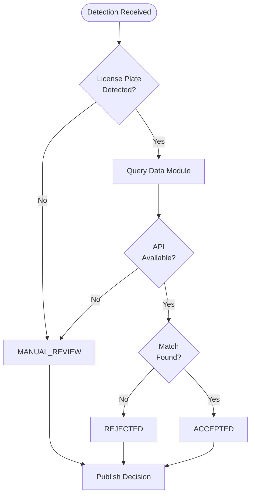

# Decision Engine - Intelligent Logistics

The **Decision Engine** is the AI-powered microservice responsible for real-time access control decisions at port gates. It processes license plate detections from Agent B and hazardous materials (hazmat) detections from Agent C, queries the Data Module for candidate appointments, applies matching algorithms, and publishes ACCEPTED/REJECTED/MANUAL_REVIEW decisions.

---

## Project Structure

```
decision_engine_microservice/
├── README.md               # This documentation
├── Dockerfile              # Container image definition
├── requirements.txt        # Python dependencies
│
└── src/
    ├── main.py             # Application entrypoint
    ├── DecisionEngine.py   # Core decision logic
    ├── un_numbers.txt      # UN hazmat code database (~3000 entries)
    └── kemler_codes.txt    # Kemler hazmat code database (~100 entries)
```

---

## Decision Flow

### 1. Receive Detection Events

The engine consumes from two Kafka topics per gate:

| Topic                  | Source   | Content                            |
|------------------------|----------|------------------------------------|
| `lp-results-{gate_id}` | Agent B  | License plate OCR results          |
| `hz-results-{gate_id}` | Agent C  | Hazmat placard detection (UN/Kemler)|

#### License Plate Payload
```json
{
  "timestamp": 1734130000,
  "licensePlate": "AA-00-BB",
  "confidence": 87,
  "cropUrl": "http://storage/crops/lp-12345.jpg"
}
```

#### Hazmat Payload
```json
{
  "timestamp": 1734130000,
  "un": "1203",
  "kemler": "33",
  "confidence": 92,
  "cropUrl": "http://storage/crops/hz-12345.jpg"
}
```

### 2. Buffer and Correlate

Detection events are buffered by `truck_id` (from Kafka message header). When both LP and HZ results are available for the same truck, decision processing begins.

```python
lp_buffer = {}  # {truck_id: lp_data}
hz_buffer = {}  # {truck_id: hz_data}

# When both are present:
if truck_id in lp_buffer and truck_id in hz_buffer:
    make_decision(truck_id, lp_buffer[truck_id], hz_buffer[truck_id])
```

### 3. Query Data Module

The engine queries the Data Module for candidate appointments within a configurable time window:

**Endpoint:** `POST /api/v1/decisions/query-appointments`

```json
{
  "time_frame": 1,
  "gate_id": 1
}
```

**Response:**
```json
{
  "found": true,
  "candidates": [
    {
      "appointment_id": 123,
      "license_plate": "AA-00-BB",
      "gate_in_id": 1,
      "terminal_id": 1,
      "scheduled_time": "2024-12-14T10:30:00",
      "status": "in_transit"
    }
  ],
  "message": "Found 3 candidate appointment(s)"
}
```

### 4. License Plate Matching

The engine uses **Levenshtein distance** algorithm for fuzzy matching to handle OCR errors:

| Feature | Description |
|---------|-------------|
| Exact Match | Distance = 0 → ACCEPTED |
| Fuzzy Match | Distance ≤ threshold (default: 2) → ACCEPTED with alert |
| No Match | Distance > threshold → REJECTED |

**Visual Confusion Matrix: (NOT IMPLEMENTED)**
The engine has support for commonly confused characters in OCR:
- `0` ↔ `O`, `D`, `Q`
- `1` ↔ `I`, `L`, `T`
- `5` ↔ `S`
- `8` ↔ `B`

### 5. Decision Logic



### 6. Publish Decision

The final decision is published to Kafka for real-time distribution:

**Topic:** `decision-results-{gate_id}`

```json
{
  "timestamp": "2024-12-14T10:30:00Z",
  "licensePlate": "AA-00-BB",
  "UN": "1203: Heating oil, light",
  "kemler": "33: Flammable liquid (flash-point 23°C to 60°C)",
  "alerts": ["Fuzzy match: detected 'AA-OO-BB' matched to 'AA-00-BB' (distance: 2)"],
  "lp_cropUrl": "http://storage/crops/lp-12345.jpg",
  "hz_cropUrl": "http://storage/crops/hz-12345.jpg",
  "route": {
    "gate_id": 1,
    "terminal_id": 1,
    "appointment_id": 123
  },
  "decision": "ACCEPTED",
  "decision_source": "engine"
}
```

---

## Decision Types

| Decision | Trigger | Action |
|----------|---------|--------|
| `ACCEPTED` | License plate matches appointment within threshold | Gate opens, appointment status → `in_process` |
| `REJECTED` | No matching appointment found | Gate remains closed, alert logged |
| `MANUAL_REVIEW` | LP not detected, or API unavailable | Operator notified for manual decision |

---

## Running Locally with Docker

### Pre-requisites

- Docker & Docker Compose installed
- Kafka broker running (default: `10.255.32.143:9092`)
- Data Module running (default: `http://localhost:8080`)

### Quick Start

```bash
cd src/decision_engine_microservice

# Build the image
docker build -t decision-engine .

# Run with environment variables
docker run -d \
  --name decision-engine \
  -e KAFKA_BOOTSTRAP=kafka:9092 \
  -e GATE_ID=1 \
  -e API_URL=http://data-module:8080/api/v1 \
  decision-engine
```

## Environment Variables

| Variable | Default | Description |
|----------|---------|-------------|
| `KAFKA_BOOTSTRAP` | `10.255.32.143:9092` | Kafka broker address |
| `GATE_ID` | `1` | Gate identifier for topic routing |
| `API_URL` | `http://localhost:8080/api/v1` | Data Module API base URL |
| `TIME_TOLERANCE_MINUTES` | `30` | Time window tolerance for appointments |
| `MAX_LEVENSHTEIN_DISTANCE` | `2` | Maximum edit distance for fuzzy matching |
| `TIME_FRAME_HOURS` | `12` | Hours before/after current time to query appointments |

---

## Kafka Topics

### Consumed Topics

| Topic | Producer | Payload |
|-------|----------|---------|
| `lp-results-{gate_id}` | Agent B | License plate OCR results |
| `hz-results-{gate_id}` | Agent C | Hazmat detection results |

### Produced Topics

| Topic | Consumer | Payload |
|-------|----------|---------|
| `decision-results-{gate_id}` | API Gateway, Data Module | Final access decision |

---

## Communication with Other Microservices

### Decision Engine → Data Module

| Endpoint | Purpose |
|----------|---------|
| `POST /decisions/query-appointments` | Get candidate appointments by gate/time |

### Decision Engine → API Gateway (via Kafka)

| Topic | Purpose |
|-------|---------|
| `decision-results-{gate_id}` | Real-time decision broadcast to WebSocket clients |

---

## Hazmat Reference Data

The engine includes comprehensive reference databases for hazardous materials:

### UN Numbers (~3000 codes)
International standard codes for dangerous goods classification.

| Example | Description |
|---------|-------------|
| 1203 | Heating oil, light / Motor spirit / Gasoline |
| 1202 | Diesel fuel / Gas oil |
| 1073 | Oxygen, refrigerated liquid |

### Kemler Codes (~100 codes)
Hazard identification numbers indicating danger type.

| Code | Meaning |
|------|---------|
| 33 | Flammable liquid (flash-point 23°C to 60°C) |
| 30 | Flammable liquid |
| 23 | Flammable gas |
| 80 | Corrosive substance |
| X | Water reactive (prefix) |
---

## Key Features

- **Fuzzy Matching**: Tolerates OCR errors using Levenshtein distance algorithm with configurable threshold
- **Visual Confusion Matrix**: Supports commonly confused characters (0/O, 1/I, 5/S, etc.) -> NOT IMPLEMENTED
- **Dual Detection Buffering**: Correlates license plate and hazmat detections by truck ID
- **Graceful Degradation**: Falls back to MANUAL_REVIEW when API is unavailable
- **Real-time Processing**: Sub-second decision latency via Kafka streaming
- **Comprehensive Hazmat Database**: Built-in UN and Kemler code reference for dangerous goods

---

## Summary Flow

```
┌─────────────────────────────────────────────────────────────┐
│                      DECISION ENGINE                         │
├─────────────────────────────────────────────────────────────┤
│                                                              │
│   LP Results ─┐                                              │
│   (Agent B)   │                                              │
│               ├──► Buffer by ──► Query Data ──► Fuzzy       │
│               │    truck_id      Module        Match         │
│   HZ Results ─┘                                              │
│   (Agent C)                           │                      │
│                                       ▼                      │
│                            ┌─────────────────────┐           │
│                            │  ACCEPTED           │           │
│                            │  REJECTED           │──► Kafka  │
│                            │  MANUAL_REVIEW      │           │
│                            └─────────────────────┘           │
│                                                              │
└─────────────────────────────────────────────────────────────┘
```