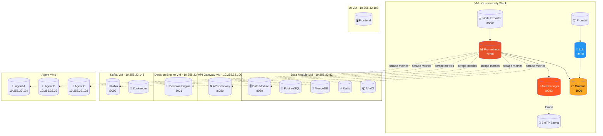

# Observability Stack - Architecture

```mermaid
flowchart TB
 subgraph subGraph0["VM - Observability Stack"]
    direction TB
        P[("📊 Prometheus<br>:9090")]
        AM[("🚨 Alertmanager<br>:9093")]
        G[("📈 Grafana<br>:3000")]
        L[("📝 Loki<br>:3100")]
        PT[("📋 Promtail")]
        NE[("💻 Node Exporter<br>:9100")]
        SMTP[("📨 SMTP Server")]
  end
 subgraph subGraph1["Data Module VM - 10.255.32.82"]
        DM[("🗄️ Data Module<br>:8080")]
        PG[("🐘 PostgreSQL")]
        MG[("🍃 MongoDB")]
        RD[("⚡ Redis")]
        MN[("📦 MinIO")]
  end
 subgraph subGraph2["API Gateway VM - 10.255.32.100"]
        API[("🌐 API Gateway<br>:8080")]
  end
 subgraph subGraph3["Decision Engine VM - 10.255.32.104"]
        DE[("🧠 Decision Engine<br>:8001")]
  end
 subgraph subGraph4["Kafka VM - 10.255.32.143"]
        K[("📨 Kafka<br>:9092")]
        ZK[("🔧 Zookeeper")]
  end
 subgraph subGraph5["Agent VMs"]
        AA[("🤖 Agent A<br>10.255.32.134")]
        AB[("🤖 Agent B<br>10.255.32.32")]
        AC[("🤖 Agent C<br>10.255.32.128")]
  end
 subgraph subGraph6["UI VM - 10.255.32.108"]
        UI[("🖥️ Frontend")]
  end
    P --> AM & G
    L --> G
    PT --> L
    NE --> P
    AM -- Email --> SMTP
    P -. scrape metrics .-> DM & API & DE & AA & AB & AC & K

    style P fill:#e6522c,color:#fff
    style AM fill:#ff5722,color:#fff
    style G fill:#f9a825,color:#000
    style L fill:#2196f3,color:#fff
    style subGraph1 stroke:#000000
```
